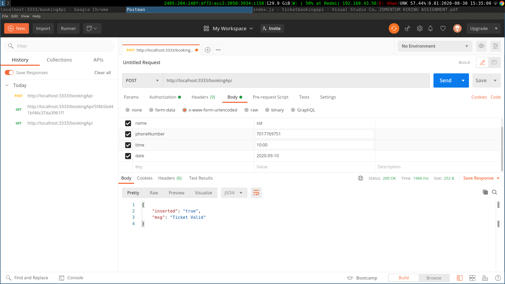
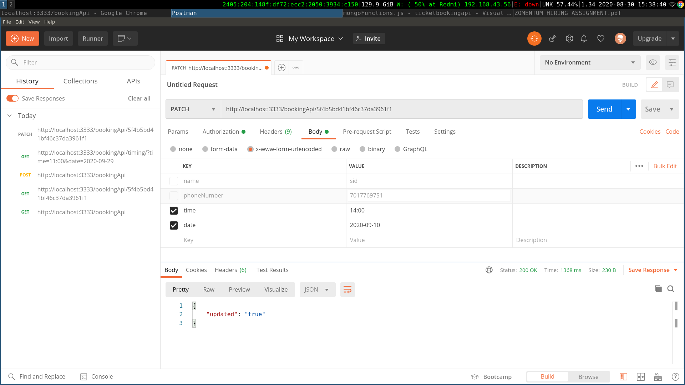
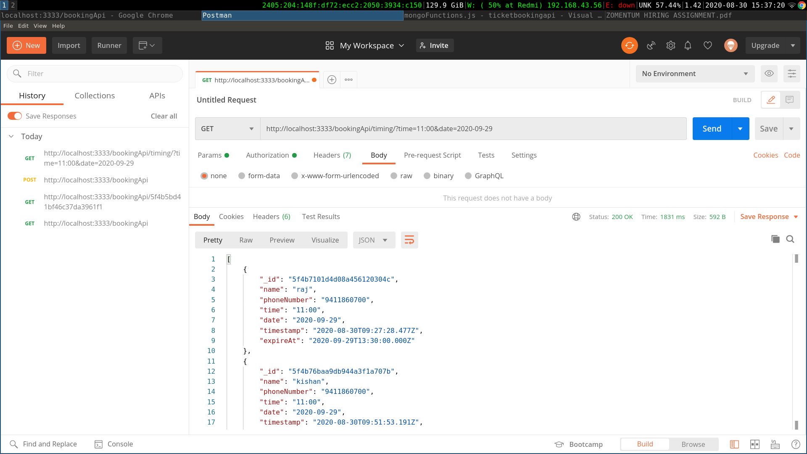
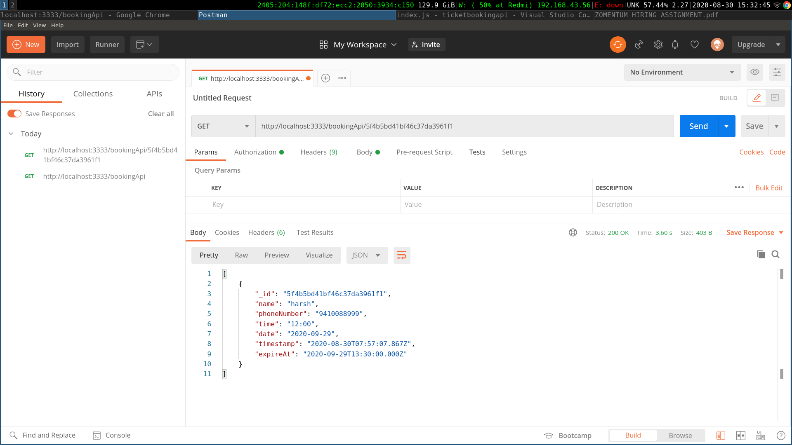
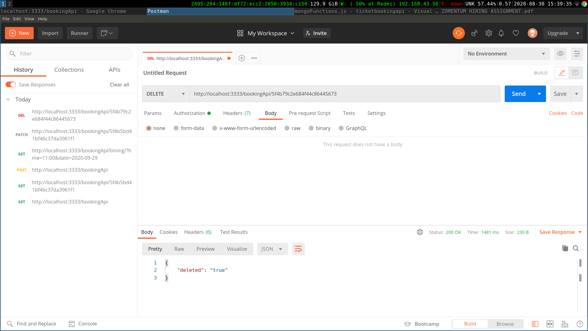
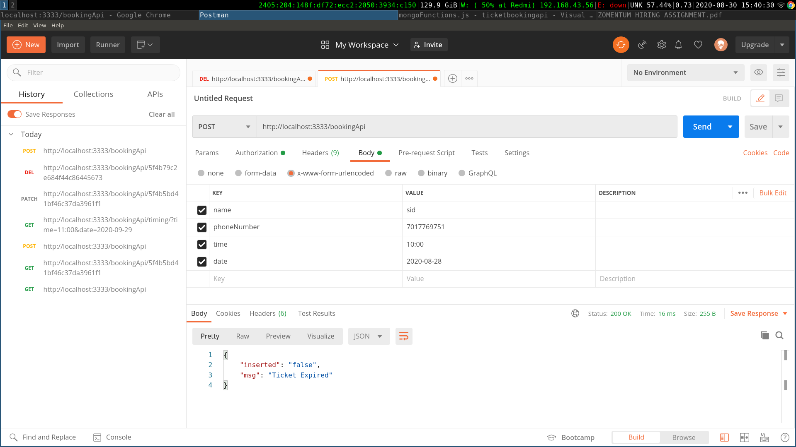
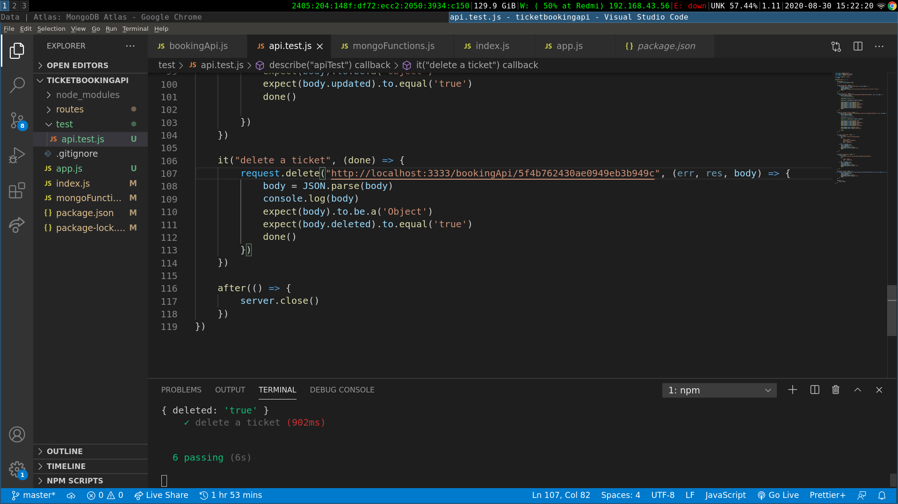

# Movie-Ticket-Booking-API
Movie-Ticket-Booking-API - Built on NodeJS(Express, Mocha, Chai) and MongoDB

[Go to Commits](https://github.com/sidcoool/Movie-Ticket-Booking-API/commits?author=sidcoool)

## Requirements

For development, you will only need Node.js and a node global package, NPM, installed in your environement.

## Install

    $ git clone https://github.com/sidcoool/Movie-Ticket-Booking-API.git
    $ cd Movie-Ticket-Booking-API
    $ npm install

## Running the project

    $ node app.js
    
## Packages and Frameworks Used
- Express : For API building and using middlewares
- MongoDB : Library for Interacting with MongoDb Atlas database
- Mocha : Running Test
- Chai : Assertion and Value Checking
- Request : For making API calls while testing

## Project Tree
```
├── app.js
├── index.js
├── mongoFunctions.js
├── package.json
├── package-lock.json
├── README.md
├── routes
│   └── bookingApi.js
└── test
    └── api.test.js
```
## Business Cases (Endpoints)

### 1) An endpoint to book a ticket using a user’s name, phone number, and timings.
   `POST http://localhost:3333/bookingApi`
   ```
   Payload Example
   {
   'name':'sid',
    'phoneNumber:'7017769751',
    'time':'10:00',
    'date':'2020-08-28
   }
   ```


### 2) An endpoint to update a ticket timing.
    `PATCH http://localhost:3333/bookingApi/:id`
 ```
   Payload Example
   {
    'time':'10:00',
    'date':'2020-08-28
   }
 ```


### 3) An endpoint to view all the tickets for a particular time.
   `GET http://localhost:3333/bookingApi/timing/?time='time'&date='data'`
 ```
   Params - 1)Time & 2)Date
 ```
 

### 4) An endpoint to view the user’s details based on the ticket id.
   `GET http://localhost:3333/bookingApi/:id`

 
   
### 5) An endpoint to delete a particular ticket.
  `DELETE http://localhost:3333/bookingApi/:id`
  

  
### 6) Mark a ticket as expired if there is a diff of 8 hours between the ticket timing and current time
  LOGIC :
  ```
    d1 = new Date()
    d2 = new Date(req.body.date + ' ' + req.body.time)

    diff = (d1 - d2) / (60 * 60 * 1000)
    if diff > 8
      ticket = expired
 ```


 ## Bonus Features-
 
 ### 1) Delete all the tickets which are expired automatically. 
   - Added TTL (Time to Live) Index in MongoDB as
```db.log_events.createIndex( { "expireAt": 1 }, { expireAfterSeconds: 0 } )```
   - Adding the following value in code
```req.body.expireAt = new Date(d1.getTime() + ((8-diff)*60*60*1000))```
   - The above line add the a expire time that is (8 - timeDifferenceInHours)

### 2) Write the tests for all the endpoints.
   - Written tests for all endpoints using Mocha and Chai 
   - Used request framework for making API requests
    

    
 ## Contact

Siddhartha Goel - [Linkedin](https://linkedin.com/in/siddhartha-goel-b2098117a) – siddharthagoel1998@gmail.com
Distributed under the MIT license. See ``LICENSE`` for more information.

[![License][license-image]][license-url]

[license-image]:https://img.shields.io/badge/license-MIT-blue.svg

[license-url]:https://raw.githubusercontent.com/clamytoe/pyTrack/master/LICENSE

  
